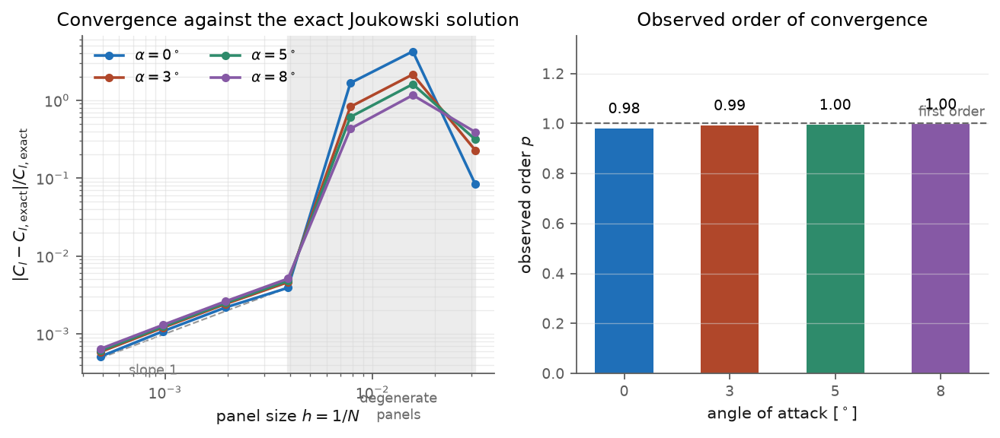
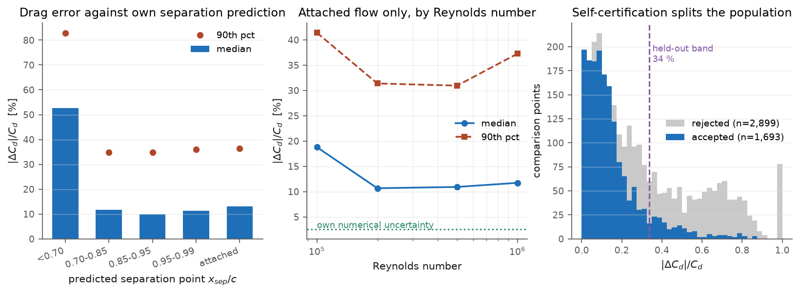

# airfoil-vv

**A coupled panel / integral-boundary-layer airfoil solver, and a measurement of
when it can be trusted.**

The solver is textbook. The point of this repository is the verification and
validation campaign around it: 4,592 comparison points against XFOIL across 28
sections and four Reynolds numbers, with the solver's own numerical uncertainty
quantified first so the disagreement means something.

Ian Stanojevic · [github.com/urgoy](https://github.com/urgoy)

[](https://github.com/urgoy/airfoil-vv/actions/workflows/tests.yml)
[](LICENSE)

**[Try the interactive solver in your browser →](https://urgoy.github.io/airfoil-vv/)**
No install: pick an airfoil, sweep angle of attack, watch lift, drag, transition
and separation update live on the same physics this study validates.



---

## The findings

**1. The method's own separation prediction tells you how wrong its lift is.**

Binned by the separation point the solver computes for itself, without any
knowledge of the reference answer:

| predicted separation | points | median \|ΔC_l\| | median \|ΔC_d\|/C_d |
|---|---|---|---|
| forward of 0.70c | 1,262 | 0.43 | 53 % |
| 0.70 – 0.85c | 481 | 0.27 | 12 % |
| 0.85 – 0.95c | 837 | 0.10 | 10 % |
| 0.95 – 0.99c | 1,174 | 0.07 | 11 % |
| attached | 838 | 0.03 | 13 % |

Lift error falls monotonically by a factor of fourteen across the range. This is
the useful result: a quantity the solver already computes is a reliable proxy for
an error it cannot otherwise see.

**2. Drag error does not improve the same way. It plateaus near 11 %.**

Once the flow is attached, refining the separation prediction buys nothing more.
That floor is the price of one-way coupling: the boundary layer never feeds back
into the pressure distribution, and no amount of attached flow removes it. It is
five times larger than the solver's own numerical uncertainty (2.6 %), so it is a
modelling error, not a discretisation error.

**3. Low Reynolds number is a separate failure mode.**

Attached-flow drag error by Reynolds number: 19 % at 1×10⁵, then 11 % from 2×10⁵
upward. Michel's criterion has no laminar separation bubble model, and below
about 2×10⁵ that is where the drag lives.

**4. The method can be made to refuse the cases it cannot handle.**

Accepting a point only when the predicted separation is aft of 0.95c *and*
Re ≥ 2×10⁵ splits the population cleanly: median drag error 11.7 % on accepted
points against 27.8 % on rejected ones. Fitted on 27 sections and scored on the
28th, held out, 89 % of accepted points fall inside the band the training
sections predicted.

The band is wide (34 %). This is an honest limit, not a good number: the rule
reliably tells you when the answer is *catastrophic*, and only loosely how good
it is otherwise.



---

## Verification first

A disagreement with XFOIL is uninterpretable until you know your own error, so
that comes first. The benchmark is a Joukowski section, whose inviscid lift is
exact in closed form:

    Γ = 4πVR·sin(α + β),    C_l = 2Γ/(Vc)

Geometry is generated analytically at every resolution, so discretisation error
is not contaminated by geometry-representation error.

| | |
|---|---|
| observed order of convergence | **p = 0.99** (first order, consistent over α = 0–8°) |
| usable panel count | N ≥ 256 |
| discretisation error at N = 320 | 0.42 % |
| chordwise re-panelling bias | up to 2.5 % |
| **combined numerical uncertainty** | **2.6 %** |

Two things this exposed that would otherwise have been invisible:

- Below N ≈ 256 the trailing-edge-clustered node distribution produces panels
  whose lengths differ by more than 1000:1 and the solution is unusable. The
  failure is silent: the solver returns a plausible-looking number.
- Re-panelling onto chordwise stations biases the lift by up to 2.5 % on a cusped
  trailing edge, and **refining the panel count does not remove it**, because the
  near-degenerate panel pair at the cusp is reproduced at every resolution. It is
  a modelling bias of the pipeline and belongs in the uncertainty budget.

NACA 4-digit sections are deliberately not used for the convergence measurement.
Their camber line is two parabolas joined at x = p which match in value and slope
but not curvature, so the surface is C¹ but not C² and the observed order is
limited by the kink rather than by the method.

## What is and is not validation

Study 2 compares against XFOIL, which is another code. That bounds *consistency
with an accepted method*, not agreement with reality, and it is labelled that way
throughout. XFOIL is the right reference because it solves the same physics with
one difference: its viscous-inviscid coupling is two-way and iterated, so every
number here estimates what the one-way approximation costs.

The only true experimental comparisons are in
`tests/test_physics.py::TestAgainstMeasuredData`, against Abbott & von Doenhoff
(*Theory of Wing Sections*, NACA Report 824) smooth-surface section drag:

| section | Re | computed | measured |
|---|---|---|---|
| NACA 0012 | 3×10⁶ | 0.0061 | 0.0060 |
| NACA 0012 | 6×10⁶ | 0.0057 | 0.0057 |
| NACA 2412 | 3×10⁶ | 0.0063 | 0.0062 |

## Reproducing it

```bash
pip install -e ".[dev,study]"
pytest                          # 19 physics and regression tests
python studies/01_verification.py
python studies/02_benchmark.py  # fetches reference polars, caches to data_cache/
python studies/03_envelope.py
```

Every number and figure in this README is regenerated by those four commands.
Reference data is cached on first fetch and never re-requested.

## The method

Lift comes from a linear-strength vortex panel method with a trailing-edge Kutta
condition. The system is factorised once per geometry for freestream (1,0) and
(0,1); every angle of attack after that is a superposition
`γ(α) = cos α·γ_A + sin α·γ_B`, so a 100-point polar costs one factorisation
rather than a hundred.

Drag comes from an integral boundary layer marched on the inviscid surface
velocity: Thwaites laminar, Michel transition, Head's entrainment method
turbulent, Squire-Young for profile drag. Transition and separation are located
between stations by interpolation rather than snapped to the nearest panel, which
matters for the convergence behaviour.

## Layout

| | |
|---|---|
| `src/panelbl/` | the solver |
| `tests/` | physics invariants, closed-form limits, measured-data checks |
| `studies/` | the three studies; each writes its own figures and JSON |
| `report/` | generated results, figures and data |
| `web/` | interactive browser front-end, live at [urgoy.github.io/airfoil-vv](https://urgoy.github.io/airfoil-vv/) |

Reference polars and coordinates from
[airfoiltools.com](http://airfoiltools.com/). MIT licensed.
